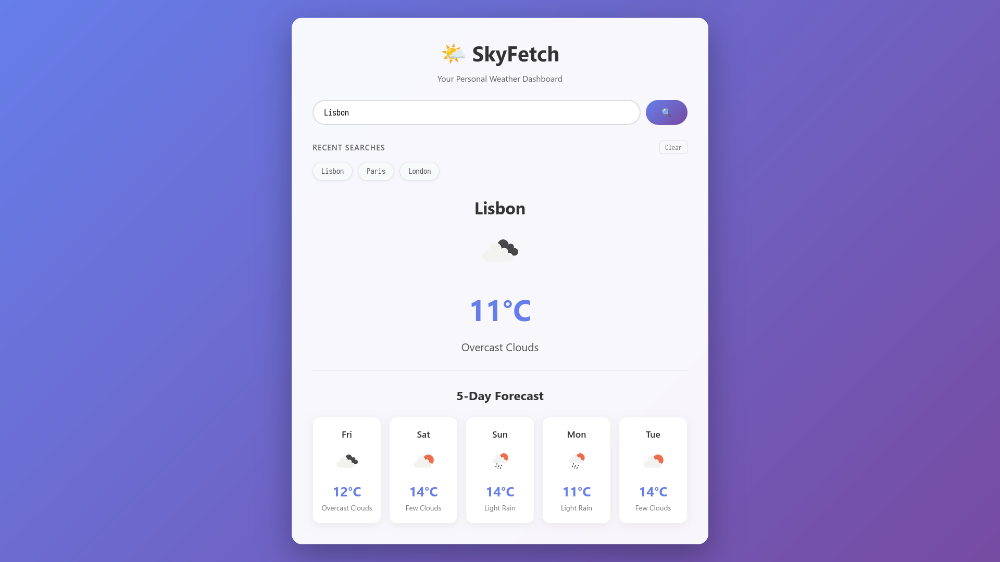

# 🌤️ SkyFetch - Weather Dashboard

A beautiful, interactive weather dashboard that provides real-time weather data and 5-day forecasts for any city in the world.

## ✨ Features

- 🔍 Search weather for any city worldwide
- 🌡️ Current temperature, weather conditions, and icon
- 📊 5-day weather forecast with daily predictions
- 💾 Recent searches saved locally
- 🔄 Auto-loads last searched city
- 📱 Fully responsive design
- ⚡ Fast and efficient API calls

## 🛠️ Technologies Used

- HTML5
- CSS3 (Grid, Flexbox, Animations)
- JavaScript (ES6+)
- Axios for API calls
- OpenWeatherMap API
- localStorage for data persistence

## 🎯 Concepts Demonstrated

- Prototypal Inheritance (OOP)
- Async/Await & Promises
- Promise.all() for concurrent API calls
- DOM Manipulation
- Event Handling
- Error Handling
- localStorage API
- Responsive Web Design

## 📸 Screenshots



## 💻 Local Setup

1. Clone the repository:

```bash
git clone https://github.com/shamblonaut/kalvium-fewd.git
```

2. Navigate to project directory:

```bash
cd kalvium-fewd/skyfetch
```

3. Get your free API key from [OpenWeatherMap](https://openweathermap.org/)

4. Create a `config.js` file in the root directory:

```javascript
const CONFIG = {
  API_KEY: "YOUR_ACTUAL_API_KEY_HERE",
};
```

5. Open `index.html` in your browser.

## 📝 License

This project is open source and available under the MIT License.

## 👨‍💻 Author

Shamblonaut

- GitHub: [@shamblonaut](https://github.com/shamblonaut)

## 🙏 Acknowledgments

- Weather data provided by OpenWeatherMap API
- Icons from OpenWeatherMap
- Built as part of Frontend Web Development Advanced Course
